# TalentPilot Mobile

Android app for TalentPilot, an AI-assisted ATS resume optimizer and job-application prep tool.

[](https://github.com/njkr/talentpilot-mobile/actions/workflows/android-apk.yml)
[](https://github.com/njkr/talentpilot-releases/releases/latest)


## Download

<table>
  <tr>
    <td valign="top">

**[Latest release (APK)](https://github.com/njkr/talentpilot-releases/releases/latest)**

1. Open the link on your phone (or scan the QR code) and download `talentpilot-<version>-<build>.apk`.
2. Open the file. When Android asks, allow **Install unknown apps** for your browser or file manager.
3. Install. Later updates arrive inside the app (see [Live updates](#live-updates)).

The APK is a sideloaded debug-signed build, so Play Protect may show a warning. It talks to the author's development API, which is not always online; to use the app yourself, [build it](#getting-started) against your own [talentpilot-api](https://github.com/njkr/talentpilot-api) instance.

</td>
    <td align="center" valign="top"></td>
  </tr>
</table>

## Screenshots

<table>
  <tr>
    <td align="center" valign="top">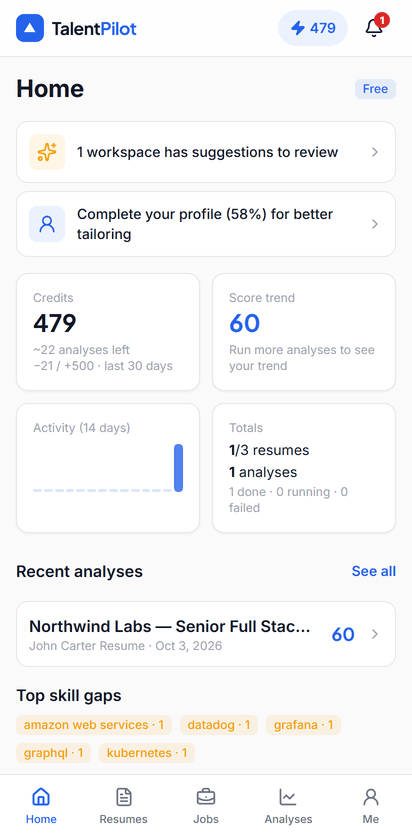<br><sub>Home</sub></td>
    <td align="center" valign="top">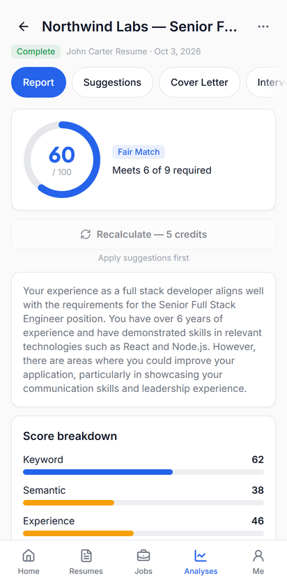<br><sub>Report</sub></td>
    <td align="center" valign="top">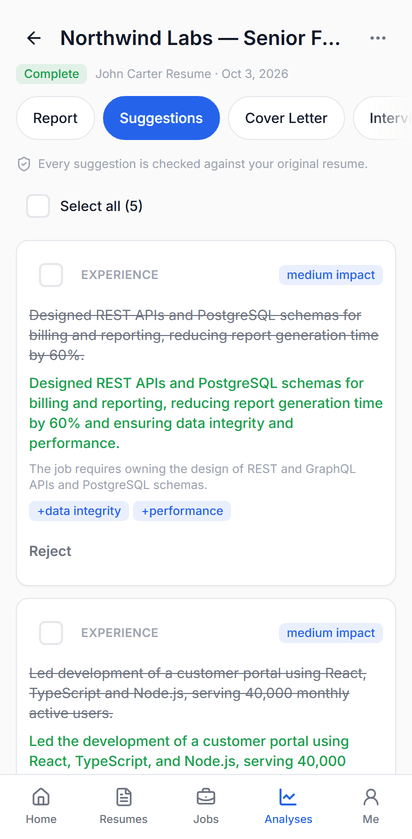<br><sub>Suggestions</sub></td>
    <td align="center" valign="top">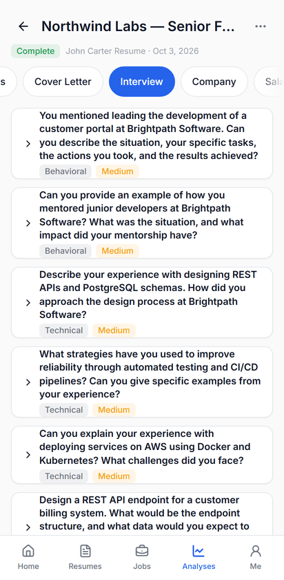<br><sub>Interview</sub></td>
  </tr>
  <tr>
    <td align="center" valign="top">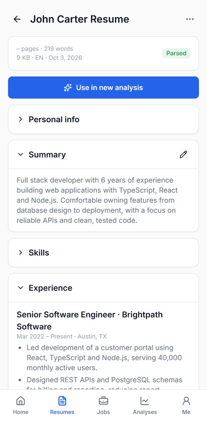<br><sub>Resume</sub></td>
    <td align="center" valign="top">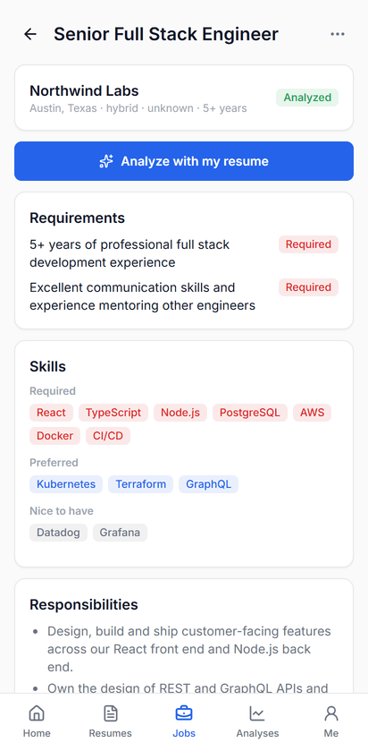<br><sub>Job</sub></td>
    <td align="center" valign="top">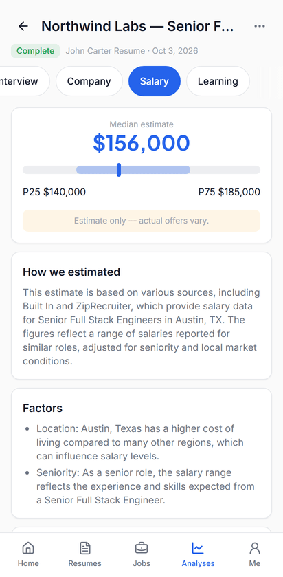<br><sub>Salary</sub></td>
    <td align="center" valign="top">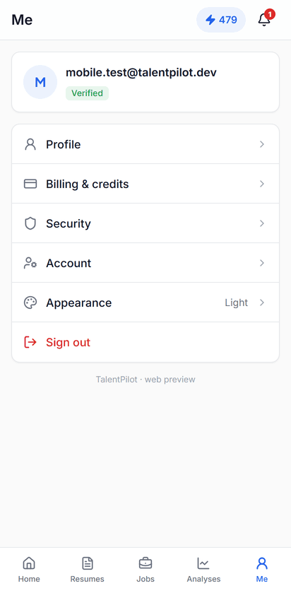<br><sub>Me</sub></td>
  </tr>
</table>

<details>
<summary>Dark mode</summary>

<table>
  <tr>
    <td align="center" valign="top">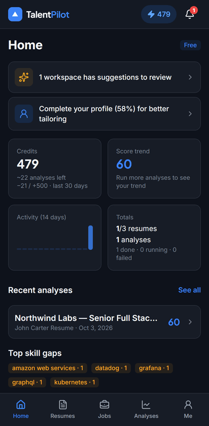<br><sub>Home</sub></td>
    <td align="center" valign="top">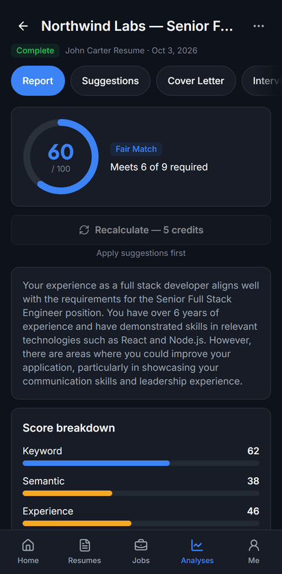<br><sub>Report</sub></td>
    <td align="center" valign="top">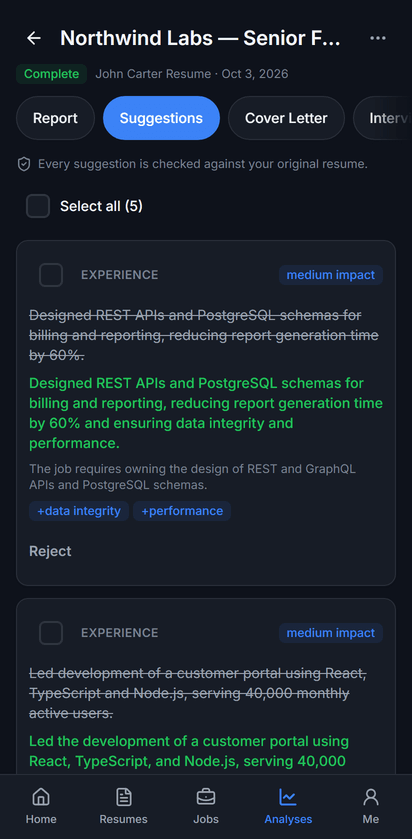<br><sub>Suggestions</sub></td>
    <td align="center" valign="top">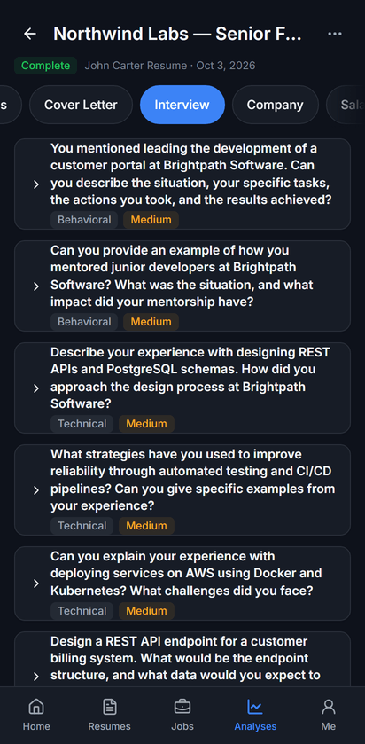<br><sub>Interview</sub></td>
  </tr>
  <tr>
    <td align="center" valign="top">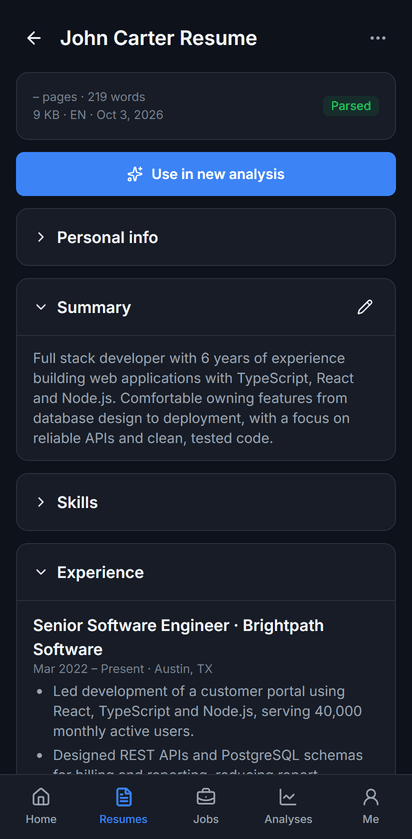<br><sub>Resume</sub></td>
    <td align="center" valign="top">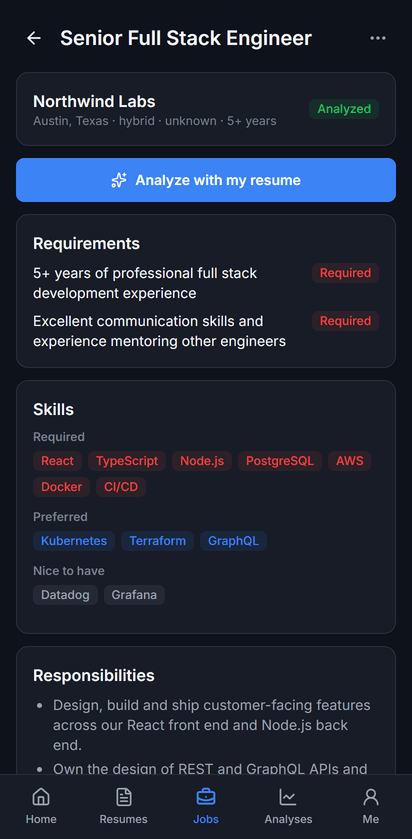<br><sub>Job</sub></td>
    <td align="center" valign="top">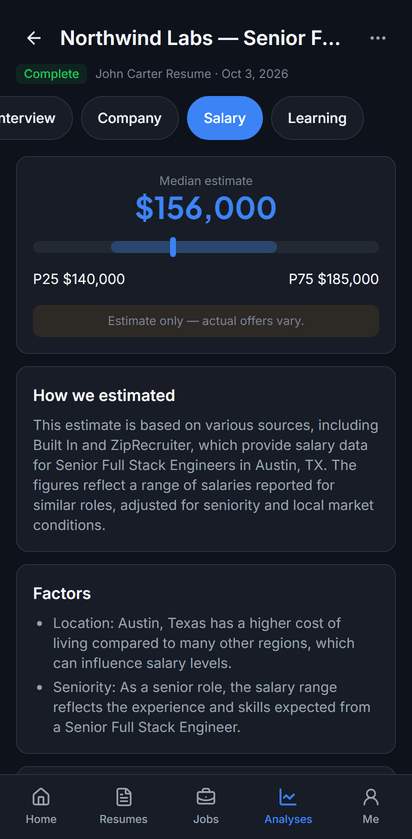<br><sub>Salary</sub></td>
    <td align="center" valign="top">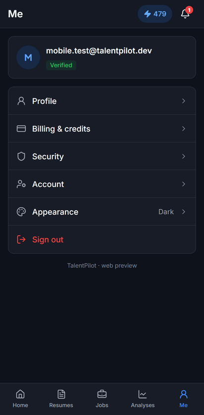<br><sub>Me</sub></td>
  </tr>
</table>

</details>

The screenshots use a test account with a fictional sample resume and job description, captured from the app running in a phone-sized browser viewport.

## Overview

Job seekers often don't know why a resume gets filtered out, or how to tailor it to a specific role without exaggerating. TalentPilot scores a resume against a job description, explains the gaps, and proposes edits that are checked against the original resume. It also prepares a cover letter, interview practice, company research, a salary estimate and a learning roadmap for the same role.

This repository is the Android client. It is a React single-page app wrapped with Capacitor, and it talks to [talentpilot-api](https://github.com/njkr/talentpilot-api). The web client lives in [talentpilot-fe](https://github.com/njkr/talentpilot-fe). Builds and updates are produced by GitHub Actions and distributed through [talentpilot-releases](https://github.com/njkr/talentpilot-releases).

## Key features

**Account**

- Email and password sign-in with OTP email verification and password reset.
- Refresh token kept in secure native storage, access token only in memory, automatic rotation.
- Device sessions list with per-device sign-out, profile, and account screens.

**Resumes and jobs**

- Resume upload with progress, parse status polling, section view, summary editing, rename, delete and retry.
- Job descriptions by paste (including from the clipboard) or file upload, with a prompt to fill in a missing company or position.

**Analyses**

- A new-analysis sheet pairs a resume with a job and shows a match gauge before credits are spent.
- Live progress over Server-Sent Events using single-use tickets, with reconnects and a polling fallback, and recovery when the app returns to the foreground.
- Failed or partial runs can be retried.

**Results**

- Report: score ring, match band, weighted score breakdown, keyword table, and a paid recalculation that is polled until the new report exists.
- Suggestions: select, apply or reject; suggestions the backend could not verify against the resume are flagged as needing more information.
- Cover letter (tone and length, regenerate, copy, share), interview questions with answer feedback and an ideal answer, company insight, salary estimate and a learning roadmap.

**Mobile experience**

- Offline banner, persisted query cache and cached user so the app opens without a connection and shows saved data; actions that need the server say so.
- Dark mode (follows the system or set manually), Android back button handling (closes sheets, then navigates), pull-to-refresh and infinite lists.
- Native share and clipboard, status bar and splash screen integration, safe-area handling.
- Credits and plan are shown in-app; changing plans opens the web app.

**Updates**

- Web changes arrive as live updates without reinstalling, and a prompt appears when a newer APK is available. See [Live updates](#live-updates).

## Tech stack

| Area              | Technology                                                                                                                                |
| ----------------- | ----------------------------------------------------------------------------------------------------------------------------------------- |
| App               | React 19, TypeScript, Vite, TanStack Router and Start (built as a static SPA for Capacitor)                                               |
| UI                | Tailwind CSS v4, shadcn/ui (Radix UI), lucide-react, framer-motion, sonner                                                                |
| Data              | TanStack Query with a persisted cache, react-hook-form and zod                                                                            |
| Native            | Capacitor 8 (Android), plugins: app, browser, clipboard, keyboard, network, preferences, share, splash-screen, status-bar, secure storage |
| Live updates      | `@capgo/capacitor-updater` in self-hosted mode                                                                                            |
| Backend           | [talentpilot-api](https://github.com/njkr/talentpilot-api) (REST and SSE)                                                                 |
| CI / distribution | GitHub Actions, GitHub Releases and GitHub Pages                                                                                          |
| Tests and tooling | Vitest, Testing Library, ESLint, Prettier, Playwright and sharp (screenshots), Bun                                                        |

## Architecture

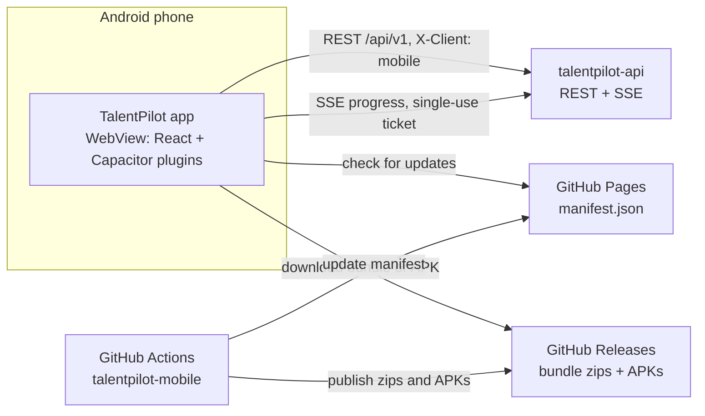

### Auth model

The app sends `X-Client: mobile` on every request. In this mode the API returns the refresh token in the response body instead of an httpOnly cookie, because a WebView cannot rely on cookies.

- The **access token** lives in memory only and is never persisted.
- The **refresh token** is stored in secure native storage (Capacitor Preferences or `localStorage` are used as fallbacks in other environments).
- Refresh tokens **rotate**: each refresh returns a new one, which replaces the old one.
- **One refresh at a time**: concurrent requests that hit a 401 share a single in-flight refresh, and a `TOKEN_SUPERSEDED` response is retried once with the stored token.
- Network errors and server errors never sign the user out; only a rejected refresh token does. A cached user lets the app open offline.

### Live updates

Two kinds of update are published to [talentpilot-releases](https://github.com/njkr/talentpilot-releases), and the app reads `manifest.json` from GitHub Pages to find them. It checks at launch and when returning to the foreground (at most every 6 hours); **Me → Check for updates** forces a check.

|               | Web bundle                                                                                    | Native APK                                                                            |
| ------------- | --------------------------------------------------------------------------------------------- | ------------------------------------------------------------------------------------- |
| Contains      | The web app (`dist/client`)                                                                   | `android/`, plugins and `capacitor.config.ts`                                         |
| Published     | Every push to `main`                                                                          | When native inputs change, or on demand                                               |
| Delivered as  | Signed zip, downloaded in the background and applied on the **next cold start**               | An "Update available" or blocking "Update required" sheet that opens the APK download |
| Compatibility | `minNativeVersionCode` in the manifest keeps a bundle away from app builds that cannot run it | `minSupportedVersionCode` can make an update mandatory                                |

After a new bundle starts, the app calls `notifyAppReady()` once it has rendered. If that call never happens (for example, a broken bundle), the updater rolls back to the previous bundle on the next launch. Bundles are encrypted in CI and the app only accepts bundles it can verify with the public key committed in this repository.

### Offline behaviour

- A banner appears when the device is offline.
- Selected queries (dashboard, resumes, jobs, workspaces, credits, profile) are persisted for 7 days and shown while offline.
- Actions that need the server are disabled with a short explanation instead of failing.

## Project structure

```
src/
  routes/          File-based TanStack Router screens (_auth.* for sign-in flow, _app.* for the signed-in shell)
  components/      Shared UI: app shell pieces, analysis/ (progress and results), update sheets, offline banner
    ui/            shadcn/ui and design-system primitives
  lib/             api client, auth, token storage, theme, native wrappers, live-update logic, query helpers
  types/           TypeScript types for the API contract
android/           Capacitor Android project (committed)
scripts/           Screenshot generator, QR generator, release/manifest scripts and their tests
docs/              Android build and update guide, API contract, screens and flows, screenshots
.github/workflows/ android-apk.yml: build, bundle signing, release publishing
capacitor.config.ts   Capacitor and updater configuration (webDir: dist/client)
vite.config.ts        Standard web build (Lovable preview)
vite.config.mobile.ts Static SPA build used by Capacitor
```

This repository is also connected to a Lovable project: changes made there are committed to `main`, and every push to `main` is built by CI.

## Getting started

Prerequisites: Node.js 22, [Bun](https://bun.sh), and a running [talentpilot-api](https://github.com/njkr/talentpilot-api). Android Studio is optional (only needed for local native builds).

```bash
bun install
echo "VITE_API_BASE_URL=https://api.example.com/api/v1" > .env.local   # your API, including /api/v1
bun run dev                                                              # http://localhost:8080
```

`VITE_API_BASE_URL` is required; production builds fail without it. See `.env.example`.

**Running against a local API:** the API's CORS allowlist (`CORS_ORIGINS`) must include the origin you use: `http://localhost:8080` for `bun run dev`, and `https://localhost` for the Android WebView (Capacitor's origin). If you expose the API through an ngrok tunnel, the app detects it and sends the header ngrok needs to skip its browser warning page.

## Building the Android app

**Locally**

```bash
VITE_API_BASE_URL=https://api.example.com/api/v1 bun run build:mobile   # static SPA in dist/client
npx cap sync android
npx cap open android                       # Android Studio, or:
cd android && ./gradlew assembleDebug      # needs JDK 21
```

**In CI** (`.github/workflows/android-apk.yml`): runs on every push to `main` and on manual dispatch. It builds the web app, zips and signs the bundle, builds the APK, and publishes to `talentpilot-releases`. Manual runs accept inputs such as `release_native`, `notes` and `build_type`. Repository secrets:

| Secret                                                                                                                       | Purpose                                                             |
| ---------------------------------------------------------------------------------------------------------------------------- | ------------------------------------------------------------------- |
| `VITE_API_BASE_URL`                                                                                                          | API base URL baked into each build                                  |
| `ANDROID_DEBUG_KEYSTORE`                                                                                                     | Stable signing key so a new APK installs over the old one           |
| `CAPGO_PRIVATE_KEY`                                                                                                          | Signs live-update bundles (the matching public key is committed)    |
| `RELEASES_REPO_TOKEN`                                                                                                        | Lets CI publish releases and the manifest to `talentpilot-releases` |
| `ANDROID_RELEASE_KEYSTORE`, `ANDROID_RELEASE_KEYSTORE_PASSWORD`, `ANDROID_RELEASE_KEY_ALIAS`, `ANDROID_RELEASE_KEY_PASSWORD` | Optional, only for `build_type: release`                            |

Each run publishes a web bundle. It also publishes a new APK when native inputs changed since the last native release (CI compares a hash stored in the manifest) or when `release_native` is ticked. Details, rollback and the update test plan are in [docs/ANDROID_BUILD.md](docs/ANDROID_BUILD.md).

## Testing

```bash
bun run test        # Vitest (jsdom): API client and token refresh, auth flow, update logic, routing, offline banner
bun run lint
node --test scripts/manifest.test.mjs   # release manifest scripts
```

To regenerate the screenshots, start the API, make sure the test account has at least one resume, job and completed analysis, then run:

```bash
TEST_EMAIL=you@example.com TEST_PASSWORD=... VITE_API_BASE_URL=http://localhost:3010/api/v1 bun run screenshots
```

The script logs in through the UI, captures each screen in light and dark mode at a Pixel 7 viewport into `docs/screenshots/`, and aborts if a screen shows an email address, phone number or name it does not expect.

## Roadmap

Not built yet:

- Push notifications (notifications are in-app only today).
- Google Play release: an Android App Bundle with Play App Signing (a release-signed APK build exists as an opt-in).
- Share a job posting from another app into TalentPilot.
- Download generated PDF and DOCX documents inside the app.
- Manage plans and payments in-app (the app opens the web client for this).
- Haptic feedback.
- iOS.

## Related repositories

- Backend API: [talentpilot-api](https://github.com/njkr/talentpilot-api)
- Web client: [talentpilot-fe](https://github.com/njkr/talentpilot-fe)
- Build artifacts and update manifest: [talentpilot-releases](https://github.com/njkr/talentpilot-releases)

## Author

**Jenkins Raj**

- GitHub: [github.com/njkr](https://github.com/njkr)
- LinkedIn: [linkedin.com/in/jenkinsraj](https://www.linkedin.com/in/jenkinsraj)
- Email: jenkinsraj@hotmail.com

## License

Copyright (c) Jenkins Raj. All rights reserved. The source is published for viewing and evaluation; no license is granted to copy, modify, or redistribute it without permission.
